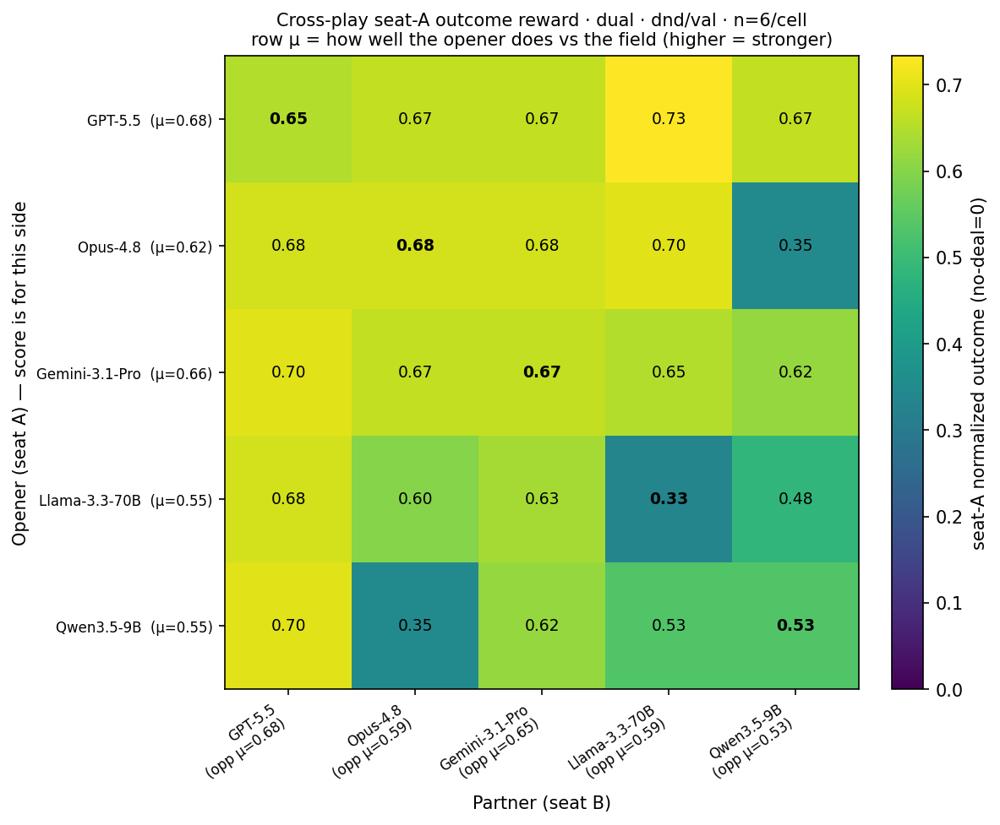

# Negotiation RLVR — Baseline Eval Report

_Generated 2026-06-09 · chosen protocol: **dual-tag** · self-play, 20 scenarios/dataset (seed 1, identical across models), ≤6 messages/agent, via OpenRouter._

## Setup

Two agents divide a shared item pool; each has private per-item values. The same model plays both sides.

- **Chosen protocol — dual-tag**: agents alternate short messages, and **each** side must finalize by emitting a `<deal>{...}</deal>` listing only the items *it* keeps; a deal closes only when the two tags exactly partition the pool. Failures are `conflict` (tags overlap / double-claim), `incomplete` (tags leave items unclaimed), or `no_deal`. Dual is chosen because it forces **both** sides to actively claim — which aligns play much more tightly with each agent's value function (see "Do agents use their values" below) — and, with the perspective-fixed prompt, its coordination overhead is no longer a spurious tax.
- The alternative **single-proposer protocol** (one agent offers via `<propose>{...}</propose>`, the other `<accept>`s; one offer always partitions the pool, so only `no_deal` can fail) is reported alongside as a baseline. Unless a table is labeled dual, the per-model results below are single-proposer baselines.
- **Verifiable metrics** (the candidate RLVR rewards): **outcome reward** = normalized self-score (`score / max_possible`, no-deal = 0); **Pareto?** = is the agreed split on the enumerated Pareto frontier; **joint efficiency** = achieved / best-achievable joint score.

## Results

**Deal-or-No-Deal** (book / hat / ball, values sum to 10):

| Model | Tier | Agree | No-deal | Outcome reward | Pareto (of deals) | Joint eff | Pts/agent | Turns |
|---|---|---|---|---|---|---|---|---|
| meta-llama/llama-3.3-70b-instruct | 70B | 100% | 0% | **0.600** | 30% | 81% | 6.00 | 4.8 |
| openai/gpt-4o-mini | small ref | 95% | 5% | **0.568** | 26% | 80% | 5.97 | 5.3 |
| qwen/qwen3.5-9b | 9B (no-think) | 100% | 0% | **0.550** | 30% | 74% | 5.50 | 4.2 |
| mistralai/ministral-8b-2512 | 8B | 100% | 0% | **0.540** | 10% | 73% | 5.40 | 3.8 |
| qwen/qwen3.5-35b-a3b | 35B-A3B (no-think) | 100% | 0% | **0.515** | 30% | 70% | 5.15 | 2.9 |
| meta-llama/llama-3.1-8b-instruct | 8B | 90% | 10% | **0.415** | 17% | 64% | 4.61 | 6.1 |
| qwen/qwen3.5-9b | 9B (thinking) | 20% | 80% | **0.100** | 50% | 66% | 5.00 | 11.4 |

**CaSiNo** (food / water / firewood, High/Med/Low = 5/4/3, max 36):

| Model | Tier | Agree | No-deal | Outcome reward | Pareto (of deals) | Joint eff | Pts/agent | Turns |
|---|---|---|---|---|---|---|---|---|
| qwen/qwen3.5-9b | 9B (no-think) | 100% | 0% | **0.514** | 45% | 93% | 18.50 | 4.2 |
| qwen/qwen3.5-35b-a3b | 35B-A3B (no-think) | 100% | 0% | **0.509** | 25% | 92% | 18.32 | 3.1 |
| openai/gpt-4o-mini | small ref | 100% | 0% | **0.507** | 30% | 92% | 18.25 | 5.2 |
| mistralai/ministral-8b-2512 | 8B | 100% | 0% | **0.503** | 25% | 91% | 18.12 | 4.2 |
| meta-llama/llama-3.3-70b-instruct | 70B | 95% | 5% | **0.478** | 32% | 91% | 18.11 | 6.0 |
| meta-llama/llama-3.1-8b-instruct | 8B | 75% | 25% | **0.378** | 33% | 92% | 18.13 | 7.0 |
| qwen/qwen3.5-9b | 9B (thinking) | 25% | 75% | **0.132** | 20% | 93% | 19.00 | 11.2 |

dnd is the discriminating task — outcome reward spreads 0.42–0.60. CaSiNo compresses everyone into 0.48–0.51 at ~92% joint efficiency, because its `{5,4,3}` values with no zero items leave little to optimize. llama-3.3-70b leads dnd (0.600); qwen3.5-9b (no-think) narrowly leads casino (0.514). (All qwen3.5 rows are no-think unless marked — see next section.)

## Frontier models (dual self-play)

One frontier model per closed vendor, run under the **chosen dual-tag protocol** on the same dnd/val scenarios (n=12, seed 1, max_turns 6) as the open-weight dual runs — so these are directly comparable to the dual rows elsewhere in this report.

| Model | Vendor | Agree | Outcome | Pareto (of deals) | Joint eff | Turns |
|---|---|---|---|---|---|---|
| google/gemini-3.1-pro-preview | Google | 100% | **0.729** | 83% | 96% | 3.4 |
| openai/gpt-5.5 | OpenAI | 100% | **0.721** | 75% | 94% | 3.7 |
| anthropic/claude-opus-4.8 | Anthropic | 92% | **0.688** | 91% | 97% | 3.3 |
| _ref:_ qwen3.5-35b-a3b (best open, dual) | open | 83% | 0.583 | 70% | — | 3.0 |
| _ref:_ gpt-4o-mini (dual) | small ref | 83% | 0.500 | 30% | 77% | 6.6 |

The frontier tier is a step change. All three close almost every deal in **~3.4 turns**, and the headline gap is **Pareto/efficiency**: 75–91% Pareto and 94–97% joint efficiency, versus ~30% Pareto for the open mid-tier. They don't just agree — they actually trade items to whoever values them most, the integrative skill the open models lack. Anthropic's opus trades highest joint efficiency (97%, Pareto 91%) for one lost deal (8% conflict); gemini and gpt-5.5 close 100% and lead on own-outcome. This is also the first protocol+model combo to make dual clearly worth its formatting cost.

## Cross-play matrix (who beats whom)

5×5 cross-play, one model per vendor, dual protocol, dnd/val, n=6 scenarios/cell. Each cell is the **opener's (seat A) normalized outcome** when row-model opens against column-model (no-deal = 0); the diagonal is self-play. Qwen runs no-think; the rest are stock.

- **Opener strength vs the field (row μ):** GPT-5.5 **0.68** > Gemini-3.1-Pro **0.66** > Opus-4.8 **0.62** > Llama-3.3-70B **0.55** ≈ Qwen3.5-9B **0.55**. The frontier three separate cleanly from the open pair.
- **As a partner, who concedes most (column "opp μ", the outcome it *allows* the opener):** GPT-5.5 is the softest partner (lets openers average **0.68**), then Gemini 0.65; **Qwen is the toughest/most extractive partner** (opponents average only **0.53** against it) — it claims aggressively for itself.
- **Opponent matters more than seat:** every model scores ~0.70 when its partner is GPT-5.5, but drops against Qwen. The standout failure is **Qwen ↔ Opus, 0.35 both directions** — that pairing only agrees **50%** of the time (a dual-tag coordination breakdown between a terse no-think small model and a verbose frontier one), torching both via no-deals. Llama self-play is also weak (0.33, only 67% agreement).
- At n=6/cell the diagonal is noisier than the n=12 self-play table above (e.g. GPT-5.5 self-play 0.65 here vs 0.721 there); read the matrix for *relative* matchup structure, not absolute levels.

## Hybrid reasoning: turn thinking OFF

Qwen3.5-9b is a hybrid-reasoning model and is the *worst* performer in default (thinking) mode — not because it negotiates badly, but because it spends its whole message budget "thinking" and rarely emits a clean `<propose>`/`<accept>` in time (~75–80% `no_deal`, ~11 turns/agent). Disabling thinking (`/no_think` soft switch + OpenRouter `reasoning.enabled=false`, via `run_eval.py --no-think`) flips it from worst to near-best:

| Dataset | Agree (think→no-think) | No-deal | Outcome | Turns |
|---|---|---|---|---|
| dnd | 20% → **100%** | 80% → **0%** | 0.100 → **0.550** | 11.4 → **4.2** |
| casino | 25% → **100%** | 75% → **0%** | 0.132 → **0.514** | 11.2 → **4.2** |

The larger MoE qwen3.5-35b-a3b behaves identically in no-think mode (≈0.51 on both datasets, ~3 turns/agent), landing in the gpt-4o-mini tier. **Takeaway: for short, turn-budgeted negotiation, run hybrid-reasoning models with thinking OFF** — the bottleneck is committing a tag within budget, not reasoning depth.

## Protocol: single-proposer vs dual-tag

Single-proposer removes a *formatting tax* that dual-tag imposes. Under dual, both agents must each emit a `<deal>` of *their own* keep, and the two must exactly partition the pool — and models kept botching the tag's **perspective**: a proposer would say "I take the book, you take the rest," then emit a `<deal>` describing the *partner's* share; the partner, "confirming," would echo the identical numbers; two identical tags double-claim the pool → `conflict`.

Rewriting the dual prompt (`prompts.py::SYSTEM_TEMPLATE`) — state that `<deal>` lists **only your own keep**, warn that the two tags are different halves that must sum to the pool, add a self-check, and include a worked example with the scenario's real item names — cut conflict for every model (dnd/val, n=12):

| Model | Conflict (before→after) | Agree | Outcome |
|---|---|---|---|
| meta-llama/llama-3.3-70b-instruct | 50% → **17%** | 42% → **75%** | 0.250 → **0.479** |
| meta-llama/llama-3.1-8b-instruct | 42% → **25%** | 8% → **33%** | 0.046 → **0.125** |
| mistralai/ministral-8b-2512 | 33% → **25%** | 0% → **25%** | 0.000 → **0.175** |

Even fixed, single-proposer stays the recommended protocol (no perspective tax at all). Switching gpt-4o-mini from dual→single lifts dnd agreement 65%→95% (outcome +0.144) and casino 92%→100% (+0.047); qwen3.5-9b in default thinking mode gains nothing here (still budget-starved) until thinking is disabled.

Under the *fixed* dual protocol, no-think models separate by capability rather than by format (dnd/val, n=12):

| Model | Agree | Conflict | Incomplete | Outcome | Pareto | Turns |
|---|---|---|---|---|---|---|
| qwen/qwen3.5-35b-a3b (no-think) | **83%** | **8%** | 8% | **0.583** | 70% | 3.0 |
| qwen/qwen3.5-9b (no-think) | 33% | 50% | 17% | 0.200 | 50% | 2.25 |

35b-a3b is the strongest dual result on record — conflict 8%, outcome 0.583 (above its own single-proposer score, since dual lets both sides claim and it hit the frontier on 70% of deals). 9b still botches the dual perspective even with thinking off (50% conflict, commits after ~2 turns): dual coordination is a capability/size limit, not a thinking-budget one. The dual protocol is now usable for studying multi-tag coordination without spurious conflict noise.

### Which tax is worse — formatting (dual) or acceptance (single)?

The two protocols trade different costs. **Dual pays a formatting tax**: deals lost to `conflict`/`incomplete` score 0. **Single pays an acceptance tax**: deals always close, but the accepter often rubber-stamps a value-blind split it never had to claim (see next section), so each closed deal is worth less. Which one nets out better depends on the model's coordination ability. Judging from `qwen/qwen3.5-35b-a3b` (no-think) on the **same 12 dnd scenarios**:

| Protocol | Close rate | Value-capture | Outcome \| agree | **Outcome (all)** |
|---|---|---|---|---|
| single-proposer | 100% | 53% | 0.583 | 0.583 |
| dual-tag | 83% (1 conflict, 1 incomplete) | 81% | 0.730 | **0.608** |

For 35b-a3b the **acceptance tax is worse than the formatting tax**: dual forfeits 17% of deals to format errors, but the deals that *do* close are far more value-aligned (value-capture 81% vs 53%, conditional outcome 0.730 vs 0.583). That +0.147 conditional gain more than pays for the lost deals, so **net outcome is higher under dual (0.608 > 0.583)** — forcing both sides to actively claim buys more than coordination overhead costs.

**But 35b-a3b is the exception, not the rule** — it does *not* generalize to the other strong models. Same matched-scenario decomposition (own normalized outcome, dnd):

| Model | single: close / VC / outcome | dual: close / VC / outcome | Net winner |
|---|---|---|---|
| qwen/qwen3.5-35b-a3b | 100% / 53% / 0.583 | 83% / 81% / **0.608** | **dual** (+0.025) |
| openai/gpt-4o-mini | 95% / 67% / **0.568** | 83% / 65% / 0.500 | **single** (+0.068) ‡ |
| meta-llama/llama-3.3-70b | 100% / 73% / **0.717** | 75% / 67% / 0.492 | **single** (+0.225) |

For gpt-4o-mini and llama-3.3-70b, **single-proposer still wins** (+0.068 and +0.225 outcome). The reason isn't coordination ability — it's that *their single-proposer accepters already protect value well* (single value-capture 67% and 73%, vs qwen's value-blind 53%). With little acceptance tax to recover, dual's formatting losses (15–25% of deals → 0) dominate, and dual doesn't even raise their value-capture (gpt 65% < 67%, llama 67% < 73%). qwen-35b is the lone beneficiary: its accepter is uniquely value-blind, so it carries a large acceptance tax that dual eliminates.

So the real lever is **not raw capability but the size of the acceptance tax** — i.e. how value-blind a model's single-proposer accepter is. Dual is only worth its formatting cost for models (like qwen-35b) whose accepter rubber-stamps badly; for models whose accepter negotiates value-aware counters (gpt, llama-70b), single-proposer is both cleaner *and* higher-scoring. **Single-proposer therefore stays the recommended default**; dual is situationally better only for the specific failure mode of a value-blind accepter.

> ‡ gpt-4o-mini's dual was **re-run with the perspective-fixed prompt** (`openai_gpt-4o-mini_dnd_val_dual_n12.json`; dnd/val, n=12, seed 1, max_turns 6): agreement 75%→**83%**, conflict 25%→**8%**, global outcome ≈0.500. The fix actually *erases* the pre-fix dual's apparent value-capture gain — that old run showed +11 vs single, but the clean run is flat (65% vs single's 67%). On the 10 scenarios agreed under **both** protocols, dual now matches single per deal (own-outcome 0.565→0.600, value-capture 65%→67%), so single's edge is **entirely its higher close rate** (95% vs 83%), not better per-deal value. Verdict unchanged. llama-70b's dual already used the fixed prompt; the gpt-4o-mini row above is computed on the same global basis as the top results table.

## Do agents use their values, or vibe-negotiate?

Metric: **value-capture** = `(achieved − worst) / (best − worst)` over the units a side ended with — given those units, did it grab the *highest*-value ones? A vibe-negotiator scores ≈0.5, a value-aware one ≈1.0 (see `analyze_value_alignment.py` / `VALUE_ALIGNMENT.md`).

Comprehension is fine; **passive acceptance is the failure.** Proposers and openers are strongly value-aligned (dnd first-offer capture 75–86%) — agents use their values when they *control* the split. The leak is the single-proposer **accepter**, which rubber-stamps what it's handed: qwen3.5-35b-a3b's proposer side scores 68% on dnd but its accepter only 40% (near random). Because dual makes *both* sides actively claim, it lifts alignment **where the single-proposer accepter was value-blind** — dramatically for qwen-35b, but negligibly for gpt-4o-mini, whose accepter already captures value well (paired, same dnd scenarios):

| Model | single → dual (value-capture) | "burned" side rate (VC<0.34) |
|---|---|---|
| qwen/qwen3.5-35b-a3b | 55% → **82%** (+28) | 32% → **11%** |
| openai/gpt-4o-mini | 65% → **67%** (+1) | 26% → 26% |

Canonical single-proposer failure (dnd, `you` values book=9, ball=0): `you` opens *"I propose keeping the book,"* the partner's prose agrees but its `<propose>` tag claims the book for itself, and `you` **accepts on the prose without checking the tag** — ending with 1 of 10 points. Under dual on the same scenario, `you` claims book+hat and gives away the worthless balls (capture 1.0). CaSiNo can't discriminate here (≈0.5 for all) — its compressed values leave nothing to steer; dnd's real zeros make it the discriminating test.

## Why Pareto is low (efficiency, not aggression)

Pareto rates sit ~30% on dnd even at ~100% agreement. This isn't under-aggression — Pareto-optimality is orthogonal to slice size (you can be on the frontier with a lopsided split, or off it with a perfectly even one). It's an *integrative* miss: agents don't route each item to whoever values it most. For additive values the shortfall decomposes exactly as **Σ (units held by the agent who values them less × the value difference)** (verified on every agreement). Across the high-agreement no-think runs, the non-Pareto agreements show:

- **88% split at least one item type** between both agents instead of one side specializing — the dominant signature (type-splitting only 58%, type-split + whole-item misassignment 30%, pure misassignment 12%).
- Mean joint gap ≈5 pts; agents still capture ~76–89% of joint value, so the binary Pareto flag overstates the loss.

Example: `you_v=[9,1,0] them_v=[2,2,2] → you=[1,1,1] them=[0,0,2]` — `you` pockets a ball worth **0** to itself, denying them 2 (pure waste). The drivers: private values are never exchanged in the short budget (agents default to face-value even splits); the reward is *own* normalized score, which doesn't target the frontier; and self-play symmetry converges on "fair" splits that are sub-optimal when valuations differ. **Lever:** raising Pareto needs integrative skill and the planned **outcome+Pareto reward ablation** — "negotiate harder" targets the wrong variable.

## Implications for RLVR

- **dnd carries the training signal**; casino saturates (everyone ~0.5 at ~92% joint efficiency) and barely discriminates. Best dnd outcome is llama-3.3-70b (0.600); the open-weight field spans 0.42–0.55 — that range is the headroom RL should close (drive `no_deal`→0, push self-score up).
- **Single-proposer isolates negotiation skill from formatting**: with coordination overhead gone, remaining `no_deal` cases are genuine failures to reach/accept in budget — a cleaner, less noisy signal.
- **Outcome reward is the primary target**, but **Pareto stays informative even at high agreement**: outcome-only optimizes own score and need not reach the frontier. The planned **outcome vs outcome+Pareto** ablation tests whether a Pareto bonus lifts joint efficiency without hurting self-score.
- Per-run transcripts + metrics are in `results/<model>_<dataset>_<protocol>_n*.json`; browse them (with failure-case highlighting) in the visualizer's **Model eval** tab.

## Caveats

- **`no_deal` only** under single-proposer (no `conflict`/`incomplete`): a no-deal means no offer was accepted within the budget; raising `max_turns` slightly can reduce it.
- **Small samples** (20 scenarios/dataset): Pareto / joint-efficiency over agreements-only are noisy when agreement counts are low.
- **Dual baselines aren't perfectly matched** (may differ in N/max_turns); treat protocol comparisons as directional.
- Frontier models (gpt-5.5, claude-opus-4.8, gemini-3.1-pro) are now included as a dual-protocol ceiling (see "Frontier models" and the cross-play matrix); the open-weight models remain the realistic RL training targets. The cross-play matrix uses only n=6/cell, so treat its absolute cell values as indicative and the matchup *structure* as the signal.
